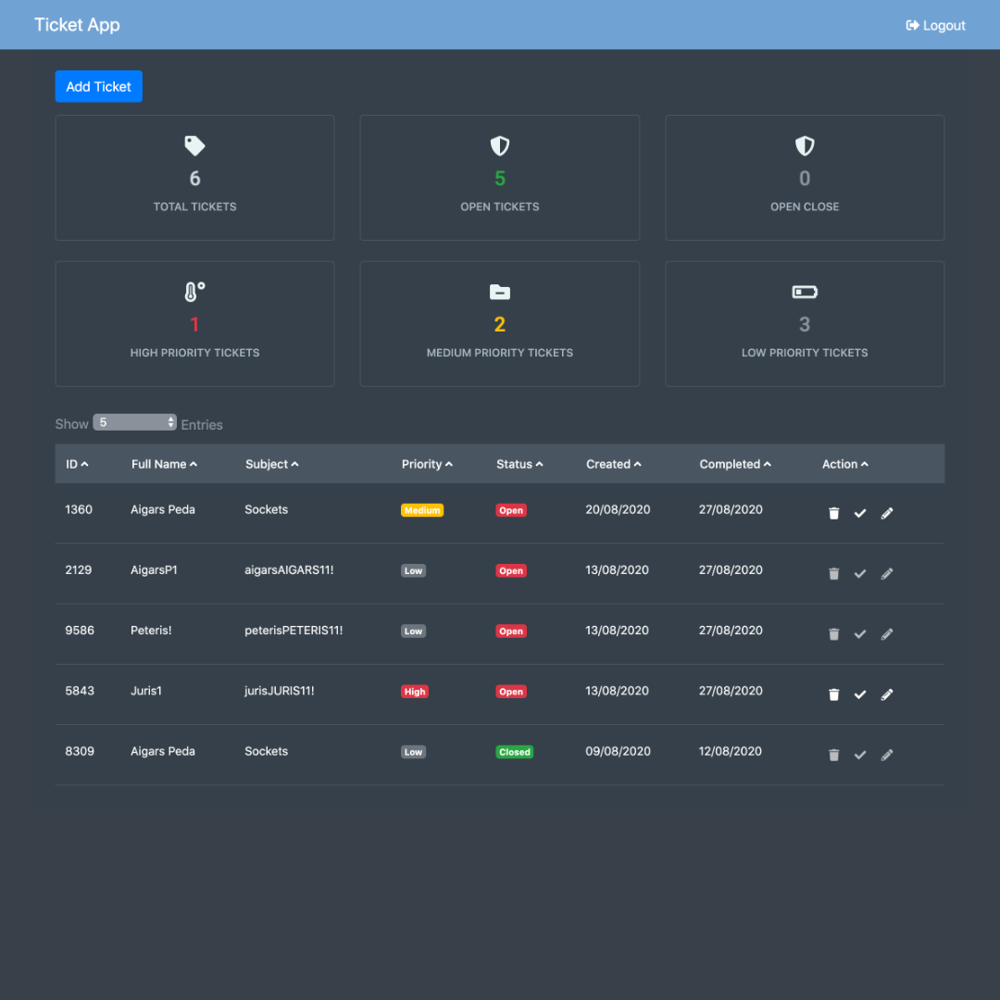
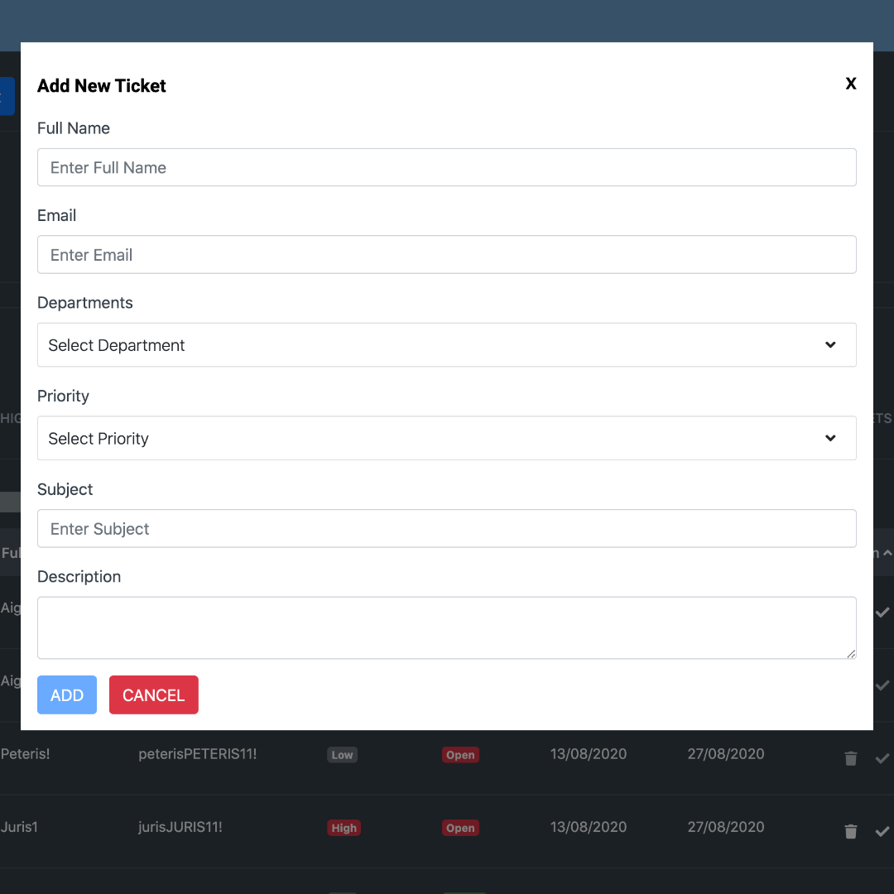
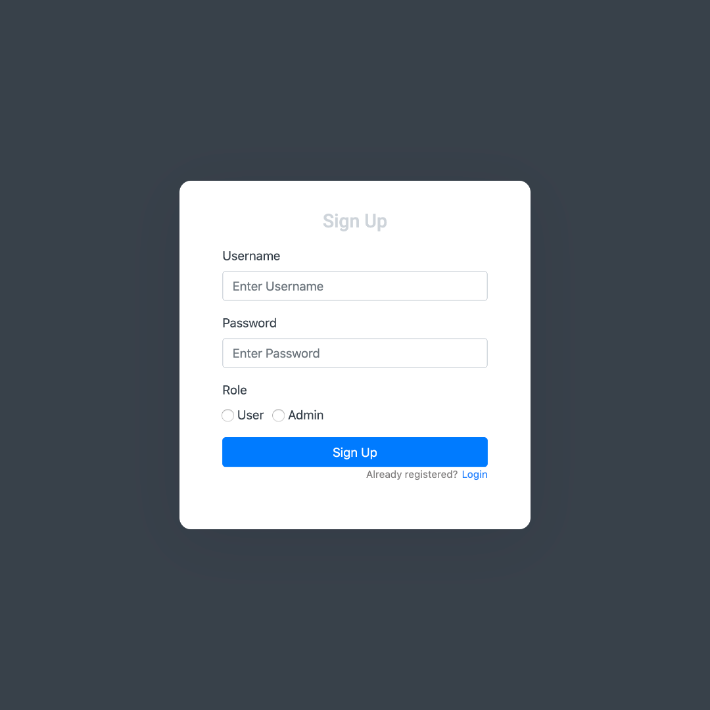
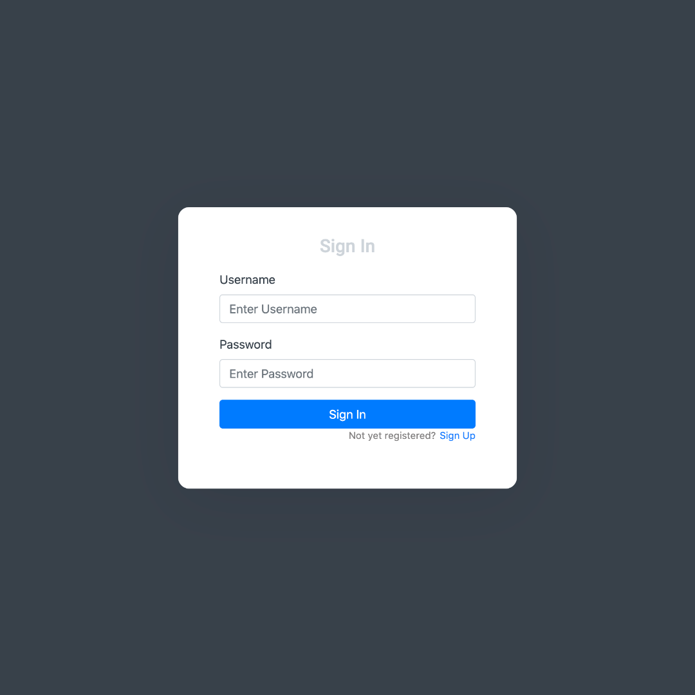

To be able to use the front-end you will also need
https://github.com/AigarsPeda/ticket-app-backend

## Download dependencies For both (front-end & back-end) run

### `npm i`

## Available Scripts For front-end

### `npm run start`

Runs the app in the development mode. 
Open [http://localhost:8080/](http://localhost:8080/) to view it in the browser.

The page will reload if you make edits. 
You will also see any lint errors in the console.

### `npm run test`

Launches the test runner in the interactive watch mode. 

### `npm run build`

Builds the app for production to the `dist` folder. 
It correctly bundles React in production mode and optimizes the build for the best performance.

## Available Scripts For backend

### `npm run dev`

Runs the app in the development mode. 
Open [http://localhost:5000/](http://localhost:5000/) to view it in the browser.

The page will reload if you make edits. 
You will also see any lint errors in the console.

## For back-end

for back end you will also need MongoDB to be installed
https://www.mongodb.com/

### `Screenshots`

